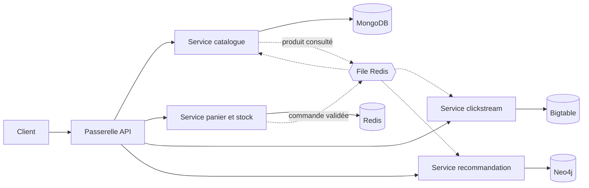

# Marketplace e-commerce : architecture multi-services NoSQL

Projet du cours NoSQL (EFREI, M1 Data Engineering & AI).

## Équipe

| Nom | GitHub |
|---|---|
| Loïc AKAMGA | @LOIC754 |
| Deiss YEHOUENOU | CharmanY |

## Objectif

Concevoir une marketplace découpée en plusieurs services indépendants. Chaque service utilise le modèle de données NoSQL le plus adapté à ses opérations : document, clé-valeur, colonnes larges ou graphe.

Le choix de chaque base est fait en amont, à partir des requêtes que le service doit servir.

## Fonctionnalités

- Parcourir et filtrer un catalogue de produits hétérogènes
- Remplir un panier et commander pendant une vente flash
- Consulter l'historique de prix d'un produit
- Recevoir des recommandations de produits

## Architecture

- Appels synchrones (REST) entre la passerelle et les services.
- Appels asynchrones par file Redis pour les événements « produit consulté » et « commande validée ».
- Un service = une base : aucun service ne lit dans la base d'un autre.

## Services et modèles de données

| Service | Opération dominante | Modèle | Base |
|---|---|---|---|
| Catalogue | Lire une fiche complète, filtrer par catégorie, prix, attributs | Document | MongoDB |
| Panier et stock | Lire et écrire un panier, décrémenter un stock, classer les ventes | Clé-valeur | Redis |
| Clickstream | Écrire en continu les événements de navigation, lire une période pour un client ou un produit | Colonnes larges | Bigtable |
| Recommandation | Parcourir les liens entre clients et produits | Graphe | Neo4j |

## Justification des choix

**Catalogue : document.** Les attributs varient selon la catégorie (taille pour un vêtement, RAM pour un PC). Un schéma flexible évite les colonnes vides et les jointures.

**Panier et stock : clé-valeur.** Accès par clé en mémoire, expiration automatique des paniers, décrément atomique du stock pendant une vente flash, file de messages entre services.

**Clickstream : colonnes larges.** Volume d'écritures élevé et lectures par plage de clés sur des séries temporelles.

**Recommandation : graphe.** Les requêtes portent sur les relations (achetés ensemble, parrainage), coûteuses à exprimer en jointures.

## Agrégats

Un agrégat est un ensemble de données liées, identifié par une clé, lu et écrit d'un seul bloc. C'est la frontière de l'atomicité.

| Agrégat | Base | Clé | Contenu |
|---|---|---|---|
| Produit | MongoDB | id produit | Nom, prix, catégorie, vendeur, attributs propres à la catégorie, stock de référence, note moyenne |
| Avis | MongoDB | id avis | Référence produit, référence client, note, texte, date |
| Commande | MongoDB | id commande | Lignes de commande, adresse, paiement, statut |
| Client | MongoDB | id client | Profil, adresses |
| Panier | Redis | `panier:{client}` | Couples produit/quantité, avec expiration |
| Stock temps réel | Redis | `stock:{produit}` | Un compteur |
| Événement de navigation | Bigtable | `client#timestamp_inversé` | Type d'événement, produit, page, appareil |
| Point de prix | Bigtable | `produit#timestamp` | Prix, vendeur |

- **Avis séparé du produit** : le nombre d'avis n'est pas borné, le produit ne garde que la note moyenne.
- **Bigtable** : l'agrégat est la ligne, seule unité atomique.
- **Neo4j** : aucun agrégat, la base ne stocke que les identifiants des clients et produits et leurs relations.
- **Classement des ventes et cache Redis** : données dérivées, pas des agrégats métier.

## Modèle de données

**MongoDB**
- Collection `produits` : champs communs (nom, prix, vendeur, catégorie, stock de référence) et sous-document d'attributs propre à la catégorie
- Texte des avis rattaché au produit
- Index sur catégorie et prix, index texte pour la recherche

**Redis**
- Panier : un hash par client, avec expiration
- Stock : un compteur par produit
- Meilleures ventes : un sorted set
- Cache des fiches produit les plus consultées
- File des événements entre services

**Bigtable**
- Table `evenements` : clé `client#timestamp_inversé` (parcours récent d'un client)
- Table `prix` : clé `produit#timestamp` (courbe de prix d'un produit)

**Neo4j**
- Nœuds : `Client`, `Produit`, `Catégorie`
- Relations : `A_ACHETÉ`, `A_CONSULTÉ`, `A_NOTÉ`, `A_PARRAINÉ`, `APPARTIENT_À`
- Requêtes cibles : produits achetés ensemble, produits achetés par le parrain ou les filleuls

## Déroulé d'une commande

1. Le client ajoute un article : écriture dans le panier Redis.
2. Il valide : décrément atomique du stock. Si le stock est épuisé, la commande est refusée.
3. La commande est poussée dans la file Redis.
4. Les consommateurs la traitent : mise à jour du stock de référence dans MongoDB, création de la relation `A_ACHETÉ` dans Neo4j, écriture de l'événement dans Bigtable.

Règle de cohérence du stock : MongoDB porte le stock de référence, Redis porte le compteur temps réel.

## Environnement

- Docker Compose : MongoDB, Redis, Neo4j, émulateur Bigtable, un conteneur par service
- Données de test : jeu de données public Olist (produits, commandes, clients, avis), complété par des événements de navigation et des parrainages générés

## Feuille de route

- [ ] Dépôt Git, README, schéma d'architecture
- [ ] Docker Compose avec les quatre bases
- [ ] Service catalogue
- [ ] Service panier et stock, file de commandes
- [ ] Service clickstream
- [ ] Service recommandation
- [ ] Passerelle API et démonstration des quatre parcours
