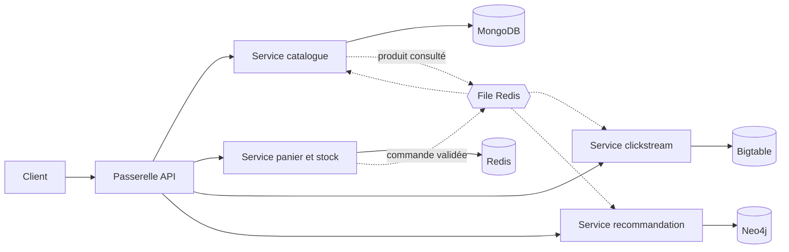
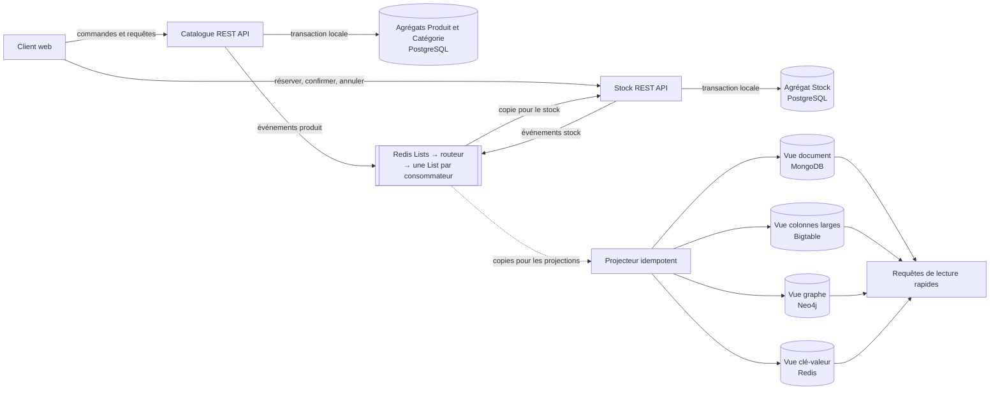

# Marketplace e-commerce : architecture multi-services NoSQL

Projet du cours NoSQL (EFREI, M1 Data Engineering & AI).

## Équipe

| Nom | GitHub |
|---|---|
| Loïc AKAMGA | @LOIC754 |
| Deiss YEHOUENOU | CharmanY |

## Objectif

Concevoir une marketplace découpée en plusieurs services indépendants. Chaque service utilise le modèle de données NoSQL le plus adapté à ses opérations : document, clé-valeur, colonnes larges ou graphe.

Le choix de chaque base est fait en amont, à partir des requêtes que le service doit servir.

## Fonctionnalités

- Parcourir et filtrer un catalogue de produits hétérogènes
- Remplir un panier et commander pendant une vente flash
- Consulter l'historique de prix d'un produit
- Recevoir des recommandations de produits

## Architecture

- Appels synchrones (REST) entre la passerelle et les services.
- Appels asynchrones par file Redis pour les événements « produit consulté » et « commande validée ».
- Un service = une base : aucun service ne lit dans la base d'un autre.

## Services et modèles de données

| Service | Opération dominante | Modèle | Base |
|---|---|---|---|
| Catalogue | Lire une fiche complète, filtrer par catégorie, prix, attributs | Document | MongoDB |
| Panier et stock | Lire et écrire un panier, décrémenter un stock, classer les ventes | Clé-valeur | Redis |
| Clickstream | Écrire en continu les événements de navigation, lire une période pour un client ou un produit | Colonnes larges | Bigtable |
| Recommandation | Parcourir les liens entre clients et produits | Graphe | Neo4j |

## Justification des choix

**Catalogue : document.** Les attributs varient selon la catégorie (taille pour un vêtement, RAM pour un PC). Un schéma flexible évite les colonnes vides et les jointures.

**Panier et stock : clé-valeur.** Accès par clé en mémoire, expiration automatique des paniers, décrément atomique du stock pendant une vente flash, file de messages entre services.

**Clickstream : colonnes larges.** Volume d'écritures élevé et lectures par plage de clés sur des séries temporelles.

**Recommandation : graphe.** Les requêtes portent sur les relations (achetés ensemble, parrainage), coûteuses à exprimer en jointures.

## Agrégats

Un agrégat est un ensemble de données liées, identifié par une clé, lu et écrit d'un seul bloc. C'est la frontière de l'atomicité.

| Agrégat | Base | Clé | Contenu |
|---|---|---|---|
| Produit | MongoDB | id produit | Nom, prix, catégorie, vendeur, attributs propres à la catégorie, stock de référence, note moyenne |
| Avis | MongoDB | id avis | Référence produit, référence client, note, texte, date |
| Commande | MongoDB | id commande | Lignes de commande, adresse, paiement, statut |
| Client | MongoDB | id client | Profil, adresses |
| Panier | Redis | `panier:{client}` | Couples produit/quantité, avec expiration |
| Stock temps réel | Redis | `stock:{produit}` | Un compteur |
| Événement de navigation | Bigtable | `client#timestamp_inversé` | Type d'événement, produit, page, appareil |
| Point de prix | Bigtable | `produit#timestamp` | Prix, vendeur |

- **Avis séparé du produit** : le nombre d'avis n'est pas borné, le produit ne garde que la note moyenne.
- **Bigtable** : l'agrégat est la ligne, seule unité atomique.
- **Neo4j** : aucun agrégat, la base ne stocke que les identifiants des clients et produits et leurs relations.
- **Classement des ventes et cache Redis** : données dérivées, pas des agrégats métier.

## Modèle de données

**MongoDB**
- Collection `produits` : champs communs (nom, prix, vendeur, catégorie, stock de référence) et sous-document d'attributs propre à la catégorie
- Texte des avis rattaché au produit
- Index sur catégorie et prix, index texte pour la recherche

**Redis**
- Panier : un hash par client, avec expiration
- Stock : un compteur par produit
- Meilleures ventes : un sorted set
- Cache des fiches produit les plus consultées
- File des événements entre services

**Bigtable**
- Table `evenements` : clé `client#timestamp_inversé` (parcours récent d'un client)
- Table `prix` : clé `produit#timestamp` (courbe de prix d'un produit)

**Neo4j**
- Nœuds : `Client`, `Produit`, `Catégorie`
- Relations : `A_ACHETÉ`, `A_CONSULTÉ`, `A_NOTÉ`, `A_PARRAINÉ`, `APPARTIENT_À`
- Requêtes cibles : produits achetés ensemble, produits achetés par le parrain ou les filleuls

## Déroulé d'une commande

1. Le client ajoute un article : écriture dans le panier Redis.
2. Il valide : décrément atomique du stock. Si le stock est épuisé, la commande est refusée.
3. La commande est poussée dans la file Redis.
4. Les consommateurs la traitent : mise à jour du stock de référence dans MongoDB, création de la relation `A_ACHETÉ` dans Neo4j, écriture de l'événement dans Bigtable.

Règle de cohérence du stock : MongoDB porte le stock de référence, Redis porte le compteur temps réel.

## Environnement

- Docker Compose : MongoDB, Redis, Neo4j, émulateur Bigtable, un conteneur par service
- Données de test : jeu de données public Olist (produits, commandes, clients, avis), complété par des événements de navigation et des parrainages générés

## Feuille de route

- [ ] Dépôt Git, README, schéma d'architecture
- [ ] Docker Compose avec les quatre bases
- [ ] Service catalogue
- [ ] Service panier et stock, file de commandes
- [ ] Service clickstream
- [ ] Service recommandation
- [ ] Passerelle API et démonstration des quatre parcours

# Marketplace e-commerce : catalogue et stock

Projet du cours NoSQL (EFREI, M1 Data Engineering & AI).

## Équipe

| Nom | GitHub |
|---|---|
| Loïc AKAMGA | @LOIC754 |
| Deiss YEHOUENOU | CharmanY |

## Objectif

Concevoir une application e-commerce limitée à deux services métier, **Catalogue** et **Stock**, en appliquant la démarche du cours :

1. chaque service possède son état et ses agrégats ;
2. les services communiquent par événements versionnés, transportés par Redis Lists et un routeur ;
3. les bases NoSQL sont des modèles de lecture dérivés des événements, jamais des sources de vérité partagées.

## Architecture

| Composant | Responsabilité | État possédé |
|---|---|---|
| Service Catalogue | Décrire les produits, fixer les prix, publier ou retirer un produit | Produits, catégories |
| Service Stock | Garantir qu'on ne vend jamais plus que le stock disponible | Stocks, réservations, copie locale des produits connus |
| Routeur d'événements | Copier chaque événement dans la List de chaque consommateur abonné | Aucun |
| Projecteur | Transformer les événements en modèles de lecture | Aucun (les vues sont reconstructibles) |

Aucun service ne lit ni n'écrit dans les tables d'un autre.

## Agrégats

Un agrégat est le périmètre d'une seule mise à jour atomique. Chaque service ne modifie que ses propres agrégats ; l'événement traverse la frontière sans créer de transaction distribuée.

### Service Catalogue

| Agrégat | Clé | Contenu | Invariants |
|---|---|---|---|
| Produit | `productId` | Nom, description, catégorie, prix courant, attributs propres à la catégorie, produits liés (substitut, accessoire), statut (brouillon, publié, retiré), version | Prix strictement positif ; un produit retiré ne peut plus être modifié |
| Catégorie | `categoryId` | Nom, catégorie parente | Pas de cycle dans la hiérarchie |

Le prix est dans l'agrégat Produit car il est lu et modifié avec lui. La catégorie est un agrégat séparé car son cycle de vie est indépendant.

### Service Stock

| Agrégat | Clé | Contenu | Invariants |
|---|---|---|---|
| Stock | `productId` | Quantité disponible, quantité réservée, réservations en cours (identifiant, quantité, expiration), version | Quantité disponible toujours positive ou nulle ; réservation impossible sur un produit inconnu ou retiré |

La réservation fait partie de l'agrégat Stock : créer une réservation et décrémenter la quantité disponible doivent réussir ou échouer ensemble.

### Règle anti-survente

Un client demande 10 unités alors qu'il en reste 3 :

- la vérification et le décrément se font dans la même transaction locale sur l'agrégat Stock ;
- la demande est refusée et la réponse indique la quantité restante ;
- chaque demande porte un identifiant unique, pour qu'une requête rejouée ne réserve pas deux fois.

## Événements

Un événement est un fait passé, immuable et versionné. Chaque événement porte `eventId` (idempotence), `eventType`, `eventVersion`, l'identifiant métier, la version de l'agrégat et un horodatage.

### Publiés par le service Catalogue

| Événement | Déclencheur | Données | Consommateurs |
|---|---|---|---|
| `ProductCreated v1` | Publication d'un nouveau produit | `productId`, nom, `categoryId`, prix | Stock, vue document, vue graphe |
| `ProductUpdated v1` | Modification du nom, de la description, des attributs ou de la catégorie | `productId`, champs modifiés | Stock, vue document, vue graphe |
| `PriceChanged v1` | Changement de prix | `productId`, ancien prix, nouveau prix | Vue document, vue colonnes larges |
| `ProductWithdrawn v1` | Retrait de la vente | `productId` | Stock, vue document, vue graphe |
| `ProductLinked v1` | Ajout d'un lien substitut ou accessoire entre deux produits | `productId`, `linkedProductId`, type de lien | Vue graphe |
| `CategoryCreated v1` | Création d'une catégorie | `categoryId`, nom, `parentId` | Vue graphe |

### Publiés par le service Stock

| Événement | Déclencheur | Données | Consommateurs |
|---|---|---|---|
| `StockReplenished v1` | Réapprovisionnement | `productId`, quantité ajoutée, quantité disponible | Vue clé-valeur, vue colonnes larges |
| `StockReserved v1` | Réservation acceptée | `reservationId`, `productId`, quantité, quantité disponible, expiration | Vue clé-valeur, vue colonnes larges |
| `ReservationRejected v1` | Quantité demandée supérieure au disponible | `productId`, quantité demandée, quantité disponible | Vue colonnes larges |
| `ReservationConfirmed v1` | Achat confirmé, sortie définitive du stock | `reservationId`, `productId`, quantité | Vue colonnes larges |
| `ReservationReleased v1` | Annulation ou expiration d'une réservation | `reservationId`, `productId`, quantité, motif, quantité disponible | Vue clé-valeur, vue colonnes larges |
| `StockAdjusted v1` | Correction après inventaire | `productId`, écart, quantité disponible, motif | Vue clé-valeur, vue colonnes larges |
| `StockDepleted v1` | La quantité disponible tombe à zéro | `productId` | Vue document, vue graphe |
| `StockRestored v1` | La quantité disponible redevient positive | `productId`, quantité disponible | Vue document, vue graphe |

### Transport

- Les deux services publient dans une seule List d'entrée : `marketplace:events:published`.
- Une List Redis est une file à consommateurs concurrents : un message retiré n'est reçu que par un seul lecteur. Le routeur lit donc la List d'entrée et recopie chaque événement dans une List par abonnement.
- Chaque consommateur possède sa List prête et sa List en traitement : `marketplace:events:{consommateur}:ready` et `marketplace:events:{consommateur}:processing`.
- Consommateurs : `stock-service`, `projection-document`, `projection-wide-column`, `projection-graph`, `projection-key-value`.
- Ajouter un consommateur ne demande qu'un nouveau descripteur de souscription, sans modifier les producteurs.

## Modèles de lecture NoSQL

Chaque projection répond à une seule question et peut être reconstruite à partir des événements.

| Modèle | Base | Question servie | Clé et structure | Levier privilégié |
|---|---|---|---|---|
| Document | MongoDB | Afficher une fiche produit complète ; filtrer le catalogue par catégorie et prix | Un document par `productId` : nom, description, prix, attributs, catégorie, indicateur en stock, date de mise à jour | Champs imbriqués et index secondaires sur catégorie et prix |
| Colonnes larges | Bigtable | Lister les mouvements récents d'un produit pour un jour donné ; tracer l'historique de ses prix | Clé de ligne `productId#jour#horodatage_inversé#eventId` : partition par produit et jour, ordre du plus récent au plus ancien | Une table par requête |
| Graphe | Neo4j | Trouver un substitut en stock quand un produit est en rupture | Nœuds Produit et Catégorie ; relations `APPARTIENT_À`, `SOUS_CATÉGORIE_DE`, `SUBSTITUT_DE`, `ACCESSOIRE_DE` | Relations, avec index sur `productId` pour le nœud d'entrée |
| Clé-valeur | Redis | Lire la quantité disponible d'un produit | Clé `stock:{productId}:available` | Duplication sous une clé connue |

## Duplication des données

Dupliquer est un contrat : une source de vérité, un mode de propagation, un retard accepté et une méthode de réparation.

| Donnée | Source de vérité | Copies | Propagée par | Réparation |
|---|---|---|---|---|
| Nom et statut du produit | Catalogue (PostgreSQL) | Copie locale du service Stock, vue document, vue graphe | `ProductCreated`, `ProductUpdated`, `ProductWithdrawn` | Réconciliation depuis le Catalogue ou rejeu des événements |
| Prix | Catalogue (PostgreSQL) | Vue document, vue colonnes larges | `PriceChanged` | Nouvel événement de correction versionné |
| Quantité disponible | Stock (PostgreSQL) | Vue clé-valeur | `StockReplenished`, `StockReserved`, `ReservationReleased`, `StockAdjusted` | `StockAdjusted` ou réconciliation depuis le Stock |
| Indicateur en stock | Stock (PostgreSQL) | Vue document, vue graphe | `StockDepleted`, `StockRestored` | Réconciliation depuis le Stock |
| Liens entre produits | Catalogue (PostgreSQL) | Vue graphe | `ProductLinked` | Reconstruction complète du graphe |

La copie locale des produits dans le service Stock lui permet de refuser une réservation sur un produit retiré sans appeler le Catalogue, même si celui-ci est indisponible.

## Synchronisation

### Appels synchrones et asynchrones

| Interaction | Style | Raison |
|---|---|---|
| Client web → Catalogue | Synchrone (REST) | L'utilisateur attend une réponse immédiate |
| Client web → Stock (réserver, confirmer, annuler) | Synchrone (REST) | Le client doit savoir tout de suite si la réservation est acceptée |
| Catalogue → Stock | Asynchrone (événements) | Pas de couplage temporel : le Stock peut être arrêté quand un produit est créé |
| Services → projections | Asynchrone (événements) | Les vues se mettent à jour sans ralentir les commandes |

Il n'existe aucun appel synchrone entre Catalogue et Stock.

### Cycle de propagation

1. Une requête arrive au service.
2. Le service modifie son agrégat dans une transaction locale.
3. Il publie l'événement dans la List d'entrée.
4. Le routeur copie l'événement dans la List de chaque consommateur abonné.
5. Chaque consommateur applique l'événement à son propre état, puis l'acquitte.

Entre les étapes 2 et 5, les copies sont en retard sur la source : la cohérence est atteinte à terme. Ce retard est attendu et doit être visible (date de mise à jour affichée sur la fiche produit).

### Garanties

- **Livraison au moins une fois** : un événement peut être reçu deux fois. Chaque consommateur est donc idempotent.
- **Idempotence** : le service Stock enregistre `eventId` dans la même transaction que sa mise à jour ; la vue colonnes larges inclut `eventId` dans la clé de ligne ; les vues document, graphe et clé-valeur écrivent des valeurs absolues, jamais des incréments.
- **Ordre** : chaque événement porte la version de l'agrégat ; un consommateur ignore un événement plus ancien que l'état qu'il possède déjà.
- **Double écriture** : l'enregistrement de l'agrégat et la publication de l'événement sont deux écritures distinctes. Si le service s'arrête entre les deux, l'événement est perdu. Parade prévue : table outbox écrite dans la même transaction que l'agrégat.

## Réplicas et cohérence

Deux notions à ne pas confondre :

- la **duplication entre services**, décrite plus haut, propagée par les événements ;
- les **réplicas d'une même base**, copies gérées par la base elle-même pour la disponibilité.

Avec des bases répliquées, une coupure réseau oblige à choisir, opération par opération, entre répondre avec une donnée peut-être périmée et refuser de répondre.

| Opération | Choix pendant une coupure | Conséquence métier |
|---|---|---|
| Parcourir le catalogue (vue document) | Disponibilité | Afficher la dernière projection avec sa date de mise à jour |
| Lire la quantité disponible (vue clé-valeur) | Disponibilité | Valeur indicative ; seule la réservation fait foi |
| Réserver du stock | Cohérence | Refuser si le service Stock ne peut pas garantir la quantité ; ne jamais confirmer deux fois les mêmes unités |
| Modifier un prix | Cohérence | Refuser plutôt que créer deux prix divergents |
| Écrire un mouvement dans la vue colonnes larges | Disponibilité | Mettre en attente dans la List et rattraper plus tard |

En fonctionnement normal, le même arbitrage oppose latence et cohérence : lire la vue document sur un réplica secondaire MongoDB est plus rapide mais peut renvoyer une donnée plus ancienne ; une lecture à la majorité est plus lente mais plus récente.

Dans l'environnement de développement, chaque base tourne sur un seul nœud : ces choix s'appliquent dès que les bases sont répliquées.

## Démarche de réalisation

- [ ] Étape 1 : état SQL. Services Catalogue et Stock avec leurs agrégats dans PostgreSQL, exposés en REST.
- [ ] Étape 2 : SQL et Redis Lists. Publication des événements, routeur, List par consommateur, copie locale des produits dans le service Stock.
- [ ] Étape 3 : projections NoSQL. Vues document, colonnes larges, graphe et clé-valeur alimentées par le projecteur idempotent.
