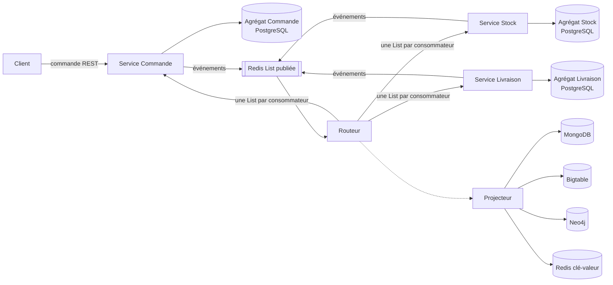

# Plateforme e-commerce NoSQL

Projet du cours NoSQL (EFREI, M1 Data Engineering & AI).

| Nom | GitHub |
|---|---|
| Loïc AKAMGA | @LOIC754 |
| Deiss YEHOUENOU | CharmanY |

## Architecture

Trois services, un agrégat chacun. Le client envoie une commande en REST ; les services se coordonnent ensuite par événements (saga chorégraphiée).



## Services et agrégats

| Service | Agrégat | Rôle | Émet | Reçoit |
|---|---|---|---|---|
| Commande | Commande | Enregistrer et suivre les commandes | `OrderPlaced`, `OrderConfirmed`, `OrderCancelled` | `StockReserved`, `StockRejected`, `DeliveryShipped`, `DeliveryCompleted` |
| Stock | Stock | Ne jamais vendre plus que le disponible | `StockReserved`, `StockRejected` | `OrderPlaced`, `OrderCancelled` |
| Livraison | Livraison | Acheminer la commande | `DeliveryShipped`, `DeliveryCompleted` | `OrderConfirmed`, `OrderCancelled` |

## Commandes REST (points d'entrée des données)

| Service | Commandes | Appelant |
|---|---|---|
| Commande | Passer une commande, annuler une commande | Client |
| Stock | Créer un produit, réapprovisionner | Administrateur |
| Livraison | Expédier, livrer | Transporteur |

## Événements

Champs communs : `eventId`, `eventType`, `eventVersion`, `orderId`, horodatage.

| Événement | Émetteur | Récepteur | Données | Effet |
|---|---|---|---|---|
| `OrderPlaced v1` | Commande | Stock | `productId`, quantité | Tente la réservation |
| `StockReserved v1` | Stock | Commande | quantité, `adresse_chargement` | Commande confirmée |
| `StockRejected v1` | Stock | Commande | quantité demandée, quantité disponible | Commande refusée |
| `OrderConfirmed v1` | Commande | Livraison | `adresse`, `adresse_chargement` | Crée la livraison |
| `OrderCancelled v1` | Commande | Stock, Livraison | motif | Libère le stock, annule la livraison |
| `DeliveryShipped v1` | Livraison | Commande | transporteur, date prévue | Commande expédiée |
| `DeliveryCompleted v1` | Livraison | Commande | date de livraison | Commande livrée |

## Contenu des agrégats

**Commande** (clé `orderId`)
- Propre : client, `productId`, quantité, prix, montant, `adresse`, statut (en attente, confirmée, refusée, annulée, expédiée, livrée)
- Copies : `adresse_chargement` (source Stock), transporteur et dates (source Livraison)

**Stock** (clé `productId`)
- Propre : nom du produit, quantité disponible, quantité réservée, adresse de l'entrepôt
- Copies : réservations en cours (`orderId`, quantité ; source Commande)
- Invariant : quantité disponible ≥ 0

**Livraison** (clé `deliveryId`)
- Propre : transporteur, statut (à préparer, expédiée, livrée, annulée), date prévue, date de livraison
- Copies : `orderId`, `adresse`, `adresse_chargement` (source Commande)

## Rôle de chaque base

| Base | Modèle | Rôle | Clé |
|---|---|---|---|
| PostgreSQL | Relationnel | Source de vérité des trois agrégats | `orderId`, `productId`, `deliveryId` |
| Redis | Clé-valeur | Transport des événements (Lists) ; lecture rapide du stock disponible | `stock:{productId}:available` |
| MongoDB | Document | Vue « suivi de commande » : commande, réservation et livraison en un seul document | `orderId` |
| Bigtable | Colonnes larges | Historique des événements par produit et par jour | `productId#jour#horodatage_inversé#eventId` |
| Neo4j | Graphe | Produits commandés par les clients ayant commandé le même produit | Nœuds Client, Produit ; relation `A_COMMANDÉ` |

Les quatre bases NoSQL sont des vues dérivées des événements, reconstructibles, jamais des sources de vérité.

## Règles indispensables

- **Un service, un agrégat, une transaction** : aucun service n'écrit dans la base d'un autre.
- **Anti-survente** : vérification et décrément du stock dans la même transaction locale ; refus avec la quantité restante.
- **Commande en attente** : réponse immédiate au client, confirmation ou refus après traitement par le Stock.
- **Une commande = un produit** : la réservation ne touche qu'un seul agrégat Stock.
- **Routeur obligatoire** : une List Redis ne diffuse pas ; le routeur recopie chaque événement dans une List par consommateur.
- **Idempotence** : `eventId` unique chez chaque consommateur ; un événement reçu deux fois n'a qu'un effet.
- **Duplication** : chaque copie a une source de vérité ; correction par un nouvel événement versionné.
- **Double écriture** : agrégat et événement enregistrés dans la même transaction (table outbox), publication ensuite.

## Origine des données

| Donnée | Origine |
|---|---|
| Produits et stock | Script d'initialisation, puis commandes d'administration |
| Commandes | Appels REST du client (manuels ou simulés) |
| Livraisons | Événement `OrderConfirmed`, puis appels du transporteur |
| Copies locales et vues NoSQL | Événements uniquement |

## Structure du projet

```
ecommerce-nosql/
├── README.md
├── .gitignore
├── .env.dev                      # ports, mots de passe locaux
├── docker-compose.dev.yml        # bases, routeur, services
│
├── contracts/                    # contrats partagés, écrits avant tout code
│   ├── events/
│   │   ├── order-placed/v1/
│   │   │   ├── schema.json
│   │   │   └── examples/order-placed.json
│   │   ├── stock-reserved/v1/
│   │   ├── stock-rejected/v1/
│   │   ├── order-confirmed/v1/
│   │   ├── order-cancelled/v1/
│   │   ├── delivery-shipped/v1/
│   │   └── delivery-completed/v1/
│   └── subscriptions/            # un fichier par couple consommateur + événement
│       ├── stock-service--order-placed.json
│       ├── order-service--stock-reserved.json
│       └── ...
│
├── order-service/
│   ├── Dockerfile
│   ├── pyproject.toml
│   ├── migrations/               # tables : orders, outbox, processed_events
│   ├── src/order_service/
│   │   ├── api.py                # points d'entrée REST
│   │   ├── domain.py             # agrégat Commande et ses règles
│   │   ├── repository.py         # accès PostgreSQL
│   │   ├── publisher.py          # outbox vers Redis
│   │   └── consumer.py           # lecture de sa List, idempotence
│   └── tests/
├── stock-service/                # même structure, agrégat Stock
├── delivery-service/             # même structure, agrégat Livraison
│
├── event-router/                 # routeur d'événements
│
├── projector/
│   ├── Dockerfile
│   ├── pyproject.toml
│   ├── src/projector/
│   │   ├── consumer.py
│   │   ├── mongo_view.py         # suivi de commande
│   │   ├── bigtable_view.py      # historique par produit et jour
│   │   ├── neo4j_view.py         # clients et produits
│   │   └── redis_view.py         # stock disponible
│   └── tests/
│
├── data/
│   └── products.csv              # produits de départ
├── scripts/
│   ├── seed_products.py          # charge products.csv via l'API Stock
│   └── simulate_orders.py        # envoie des commandes de test
└── docs/
    ├── adr/                      # décisions d'architecture
    └── diagrams/
```

## Étapes de réalisation

- [ ] 1. État SQL : trois services REST avec leur agrégat dans PostgreSQL
- [ ] 2. Redis Lists : publication des événements, routeur, consommateurs idempotents
- [ ] 3. Projections NoSQL : MongoDB, Bigtable, Neo4j, Redis clé-valeur
